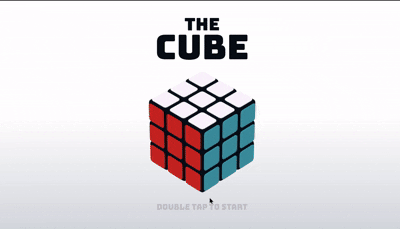

# The-Cube

An interactive 3D cube built with pure **HTML**, **CSS**, and **JavaScript**, showcasing real-time rotation, hover effects, and user-driven controls. Perfect as a portfolio piece or UI/UX demo, it demonstrates mastery of modern CSS transforms, animations, and event-driven scripting.

---

## 🚀 Key Features

- **Real-time 3D Rotation**  
  Smooth, continuous cube spinning controlled via **mouse drag** or **arrow keys**.

- **Face Interactivity**  
  Hover states and click handlers on each face to trigger callbacks or display custom content.

- **CSS-Only Perspective & Animation**  
  Leverages `transform: perspective()`, `rotateX()`, `rotateY()`, and `@keyframes` for performant visuals without external libraries.

- **Responsive Design**  
  Automatically scales and recenters on any viewport, from desktop monitors to mobile screens.

- **Modular & Extensible**  
  Clean, well-commented codebase—easily add new faces, textures, or integrate into larger web apps.

---

## 🛠 Tech Stack

- **Markup:** Semantic HTML5 structure  
- **Styles:** CSS3 3D transforms, animations, flexbox for layout  
- **Scripting:** Vanilla JavaScript with event listeners and `requestAnimationFrame` for smooth rendering  

---

## 📂 Project Structure

```
The-Cube/
│── index.html      # Main HTML file
│── style.css       # Cube styling and animations
│── script.js       # Interaction logic (rotation, events)
│── demo.gif        # Demo video
└── README.md       # Documentation
```
---
##⚡ Getting Started

1.Clone the repo:

      `git clone https://github.com/your-username/The-Cube.git`

2.Open index.html in your browser.
3.Interact with the cube using your mouse or keyboard.

---

## 🎮 Controls

- Drag Mouse → Rotate cube
- Arrow Keys → Rotate along X/Y axis
- Hover → Highlight face
- Click → Trigger custom face action

  ---

## 📸 Demo Preview



---

## ✨ Made with ❤️ using HTML, CSS, and JavaScript.
